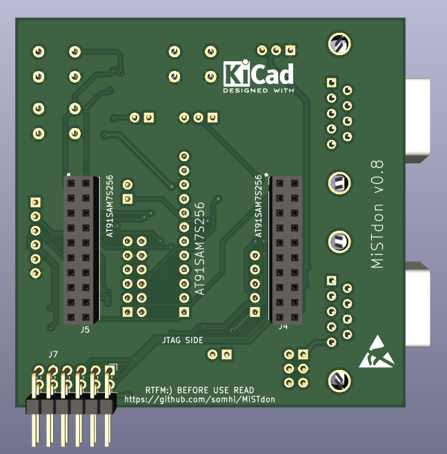

# DECA Retro Cape 2

### (2 layer - MiSTer module SDRAM version)

MiSTdon is an addon for any FPGA to be nearly compatible with the [MiST FPGA](https://github.com/mist-devel/mist-board/wiki) platform. 

Project has been developed with KiCAD 6.0.11. 

### Status

STATUS (25/02/23):  prototype design work finished. v0.7 gerbers sent to JLCPCB for manufacturing.

### Credits

Acknowledgements and thanks for help go to Jepalza, Volton and Manuferhi.

### **Schematic**

 [MiSTdon.pdf](MiSTdon.pdf) 

### **Features**

* Socket for AT91SAM7S256 board (MCUzone)
* Socket for USB Host Shield Mini (MAX3421E) 
* PMOD for SD card (Digilent)
* PMOD for FPGA interface (fits nicely in [Deca retro cape 2](https://github.com/somhi/DECA_retro_cape_2))
* Two DB9 joystick ports
* OSD and USER button for core, and pins for SW2 debug buttons
* Reset button for ARM, USB and FPGA (if used)
* UART debug pins
* Passive serial pins
* Power pins

See main repository [Readme](../README.md) for materials list

### **Important Usage notes**

* **Better do not connect/disconnect interfaces while the board is powered**
* **Read jumper selection below.**

### **Jumper Selection**

Defaults are OPEN (jumper not placed or not soldered) and CLOSED (jumper placed or soldered)

* JP1 jumper closed connects 5V to USB VBus (**make sure before place jumper to cut the R222 track in MAX3421E USB Mini shield**). In case of doubt do not place this jumper, so not all USB peripherals will work at 3V3 which is applied to VBus when jumper disconnected.

* JP2 solder jumper. Central position with GND for SD Cards without this signal. Central position with CD for Digilent Pmod SD card.  In case of doubt solder central position and GND.

### 3D model

### Changelog

v0.7 finished prototype desing. Gerber sent to JLCPCB for manufacturing

