# MiSTdon - MiST addon 

This is a compendium of all that is needed to build a MiST prototype for any FPGA to be nearly compatible with the [MiST FPGA](https://github.com/mist-devel/mist-board/wiki).

Current status:

* [PCB design finished](MiSTdon.kicad/). Tests are Ok, but original firmware at 24 Mhz is giving bus noise, so **a** **modified firmware at 16 MHz is needed.**

* Working prototype made in a protoboard

* After a reset it stops working (see notes below) 
* Passive serial flashing of the FPGA has not been implemented as my FPGA does not have that possibility. I power supply the FPGA and MiST addon, then load the bitstream from the PC though JTAG.

Acknowledgements and thanks for help go to Jepalza, Volton and Manuferhi.

## Resources

* foroFPGA Jepalza's inspirational post http://www.forofpga.es/viewtopic.php?t=289

* MiST firmware
  * Source code https://github.com/mist-devel/mist-firmware
  
  * .bin latest binary firmware https://github.com/mist-devel/mist-binaries/tree/master/firmware
  
  * Flash firmware: [Atmel SAM-BA v2.18](https://www.microchip.com/developmenttools/ProductDetails/SAM-BA In-system Programmer). Follow [instructions](https://github.com/mist-devel/mist-board/wiki/HowToInstallTheFirmware).
    
    Note that the board cannot be programmed when the SD_CD signal is connected to GND.
  
* References [folder](references/)

## Materials

* USB Host Shield Mini (MAX3421E)  https://chome.nerpa.tech/arduino_usb_host_shield_projects/
  * Mini versión https://www.amazon.es/dp/B07Y83TJ47
  * Alternative https://es.aliexpress.com/item/1005002399157571.html
  
* SD card
  * https://digilent.com/shop/pmod-microsd-microsd-card-slot/
  * Alternative https://a.aliexpress.com/_EIKRgpj (SD module)
  
* AT91SAM7S256
  * MCUzone board http://www.mcuzone.com/shop/?product-6.html
    * https://a.aliexpress.com/_EuCplo9
  * Alternative Olimex board https://www.olimex.com/Products/ARM/Atmel/SAM7-H256/

* USB HUB  (optional). Can be any USB Hub, but if you want the reset button to work should be an IC like the FE2.1 used in MiSTer

  

## Pictures

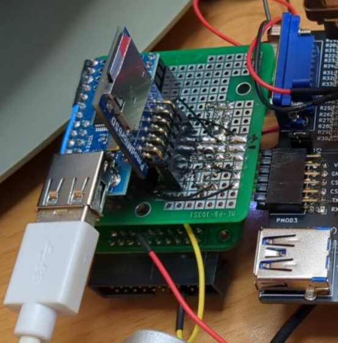

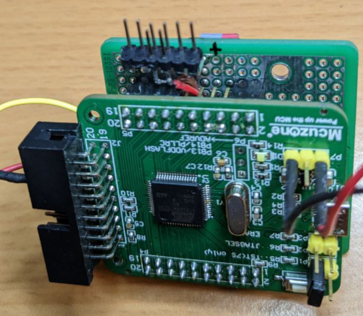

## Main assembly tips

* Do not use Dupont wires for SPI lines
* Use SCK terminal resistors in all three SCK lines (47 Ohm is a good value)
* Attention must be paid to Reset signal (read below)

## Schematic

 [MiSTdon.pdf](MiSTdon.kicad/MiSTdon.pdf) contains a first draft of the schematic. All the related schematics where I based my design from are in the references [folder](references/Schematics/). 

Follows notes of what I have wired in my prototype.

#### **JTAG and Reset**

First diagram is already assembled in the MCUzone AT91SAM7S256 board.  

If you want to assemble your own PCB I've been told not to mount the electrolytic capacitor because it can make troubles. Have a look at the SiDi schematics.  

The reset signal is connected to the FPGA (not used), to the SAM, to the MAX and to the TUSB (HUB). 

This reset signal synchronizes the three ICs. If they are not synchronized, it does not recognize the USB.

The length of the reset signals between the MAX, the TUSB and the SAM is key. If they are unbalanced, it does not recognize the USB either. 

Without connecting the RST signal well, it will only work when it starts, but after a reset it will stop working.  

Thanks for the information to [Manuferhi](https://manuferhi.com/) (SiDi (MiST compatible) manufacturer).

In the schematics from other guys, they just connected the RST signal from MAX3421E directly to 3V3.

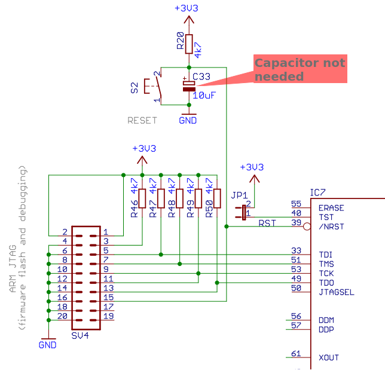

#### **Main Circuit (SAM7s and MAX3421E)**

In green what I have connected in my prototype. 

In yellow optional parts. The INT interrupt signal might be optional but I have wired it anyway.

SCK terminal resistors marked in red are mandatory to stabilize the clock signal. As recommended by [Manuferhi](https://manuferhi.com/) (SiDi manufacturer), I have used 47 Ohm value resistors. 

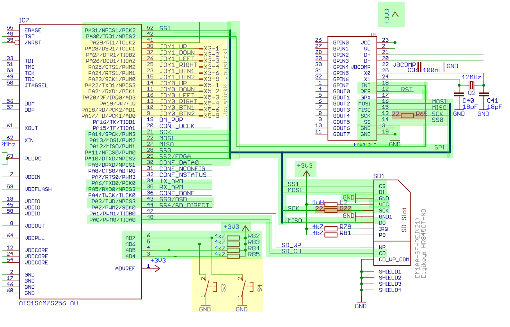

#### FPGA connections

In green what I have connected in my prototype. 

In yellow optional parts. 

SCK terminal resistors marked in red are mandatory to stabilize the clock signal. As recommended by [Manuferhi](https://manuferhi.com/) (SiDi manufacturer), I have used 47 Ohm value resistors. 

Passive serial pins has not been connected as my [DECA FPGA](https://github.com/decafpga) does not have that possibility to flash cores.

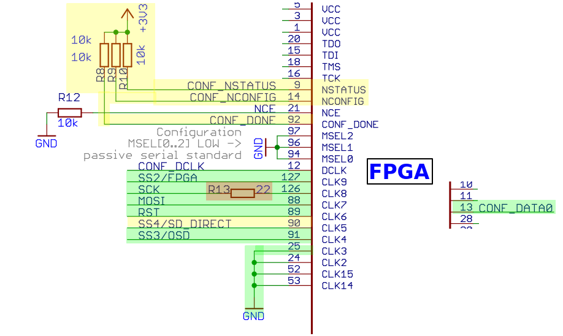

## Pinouts

#### AT91SAM7S256 pinout (MCUzone)

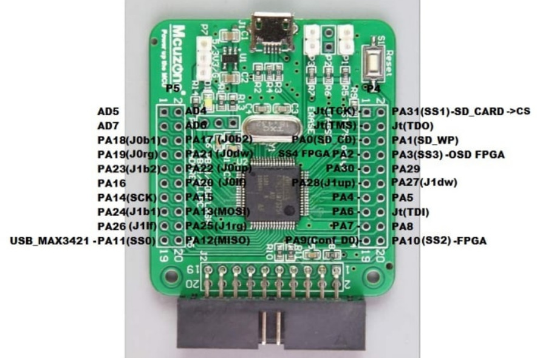

Connections:

* J0, J1 are Joystick port signals (DB9) (not connected in my prototype)

* SD_CD signal to GND (or to the SD card module if has this signal)

  SD_ WP leave it unconnected

* AD6, AD7 connected to 3V3 pull-ups. If you add buttons like in the MiST schematic could be used as OSD and User buttons.

  AD4, AD7 connected to 3V3 pull-ups (in MiST schematic those inputs are connected to microswitches and are used to debug purposes like in ATARI core).

* MOSI, MISO, SCK connected to respective pins of SD Card, USB Host and FPGA boards

  * The Master is the AT91SAM7S256. All others are slave.
  * MOSI connects to FPGA DI pin
  * MISO connects to FPGA DO pin

* SS0 to USB Host shield (SS pin of MAX3421E)

* SS1 to SD card reader (CS pin)

* SS2, SS3, SS4, CONF_D0 to FPGA

  * SS2 is FPGA select signal
  * SS3 is OSD select signal 
  * CONF_D0 is User_io select signal
  * SS4 is SD direct signal (optional as is just used in a few cores)

* PA30 to INT signal of MAX3421E

* PA5 and PA6 are Rx/Tx signals respectively, and their purpose is to debug the MiST firmware.

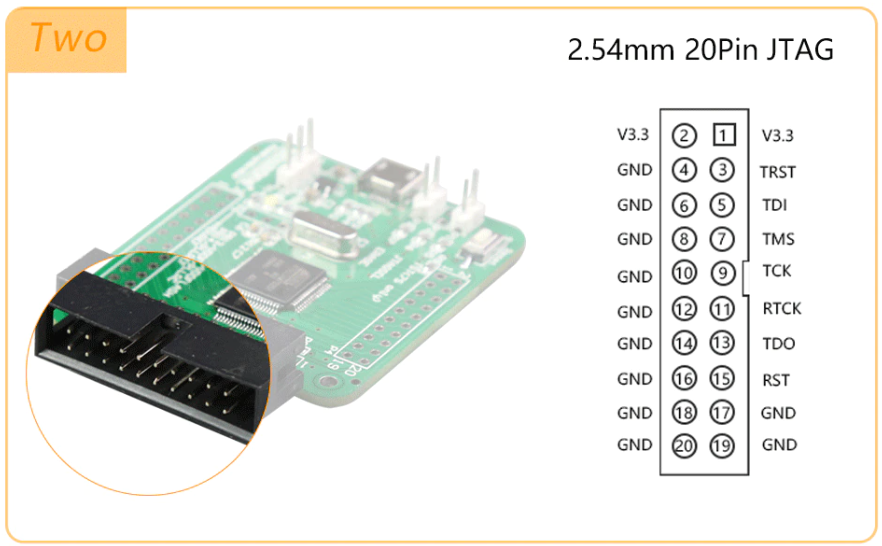

Pins 3 and 15 are connected to the Reset button of the AT91SAM7S256 board.  **Please note that the above view on JTAG connector is from the cable point of view, not the connector. Check pin 1 on PCB silkscreen before connecting RST pin**.

In my prototype I connected one of those pins to the RST pin of MAX3421E.

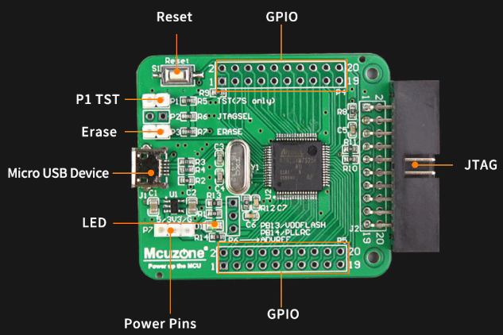

#### USB Mini Host shield pinout (MAX3421E)

There is a typo in the silkscreen of USB Mini Host clones.  Just verify for yourself which ones are the correct MOSI and SCK pins.

A cut in the track to +5V should be made if you want maximum compatibility with 5V USB peripherals. 

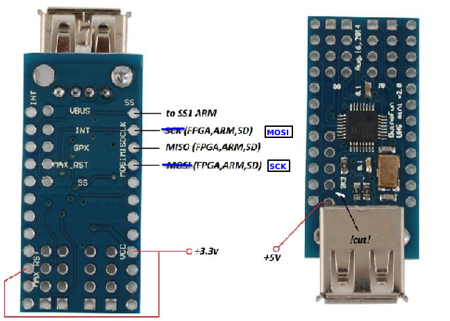

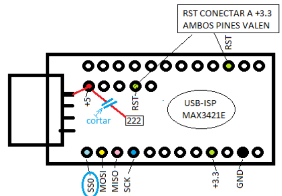

#### Pmod SD card pinout (Digilent)

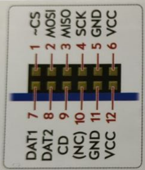

#### Power supply

5V and GND from FPGA to the  AT91SAM7S256 board.  

3V3 and GND from FPGA (like PMOD connector) to the protoboard which power supply the Pmod SD card and the MAX3421E

5V from FPGA to the  VBUS pin of MAX3421E board.  

